# Fuelled

<p align="center">
  
</p>

<!-- cmp:generated evidence -->
[](https://github.com/kvdm-co-pilot/create-cmp) — the verify lane passed at `cb079ff` on 2026-09-03 at rung **L1 · desktop**. Earned by: `specCoverage`, `approvals`, `componentStories`, `reachability`, `archDoc`, `schemaHistory`, `build`, `unitTests`, `conformance`, `goldenTrees`, `a11y`, `releaseBuild`. The tree had 6 uncommitted files at attestation, so this describes that run, not that commit. The rung describes that run; it says nothing about changes made since.
<!-- /cmp:generated -->


A Kotlin / Compose Multiplatform app, generated by
[create-cmp](https://github.com/kvdm-co-pilot/create-cmp) with a **verification harness**:
the architecture, testing conventions, and definition of done are enforced mechanically, not
by convention. Start with [`docs/DESIGN-SYSTEM.md`](./docs/DESIGN-SYSTEM.md) (the design language, incl. motion) · [`docs/ARCHITECTURE.md`](./docs/ARCHITECTURE.md); AI collaborators
follow the contract in [`CLAUDE.md`](./CLAUDE.md).

## The app

Five doors, one dashboard. Rendered headlessly from the real screens — real DI, real theme,
seeded data — by `./gradlew :composeApp:renderScreens`; no device involved.

| Today | Week | Meals | Training | Profile |
|:--:|:--:|:--:|:--:|:--:|
| 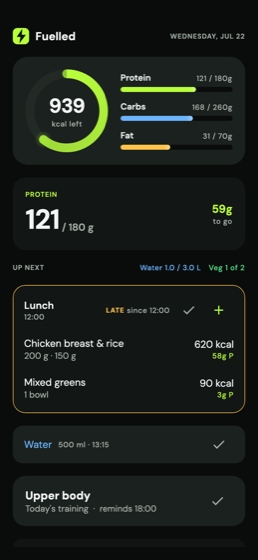 | 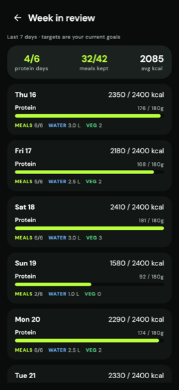 | 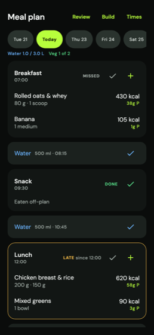 | 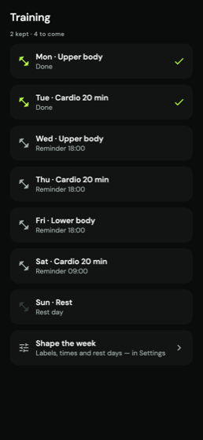 | 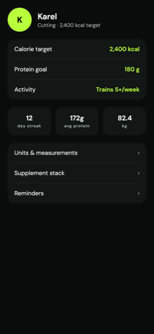 |

<table>
<tr>
<td width="50%">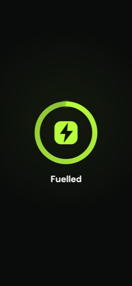</td>
<td width="50%">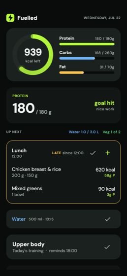</td>
</tr>
<tr>
<td><b>The ignition, at rest.</b> Its ring is a shared element with Today's — when the app
opens, that ring flies into the dashboard rather than cutting to it.</td>
<td><b>The day, met.</b> Reaching the goal takes one lime sweep across the surface on
<code>Celebration</code>, and a <code>Confirm</code> haptic. Once per logical day, nothing else.</td>
</tr>
</table>

## Motion — the design system, moving

Six durations, four curves, three springs and one arrival stagger, declared in
[`Tokens.kt`](composeApp/src/commonMain/kotlin/com/kvdm/fuelled/presentation/theme/Tokens.kt)
and read through a `MotionScheme` that honours reduced motion by construction. Screens compose
motion primitives; they never animate by hand. A `tween(` or `spring(` whose spec is not one of
these fails a conformance gate — the same way a hardcoded colour does.

> **Every figure below is generated from those tokens** by
> [`docs/assets/motion/generate.mjs`](docs/assets/motion/generate.mjs). The springs are
> integrated from the same damped harmonic oscillator the Compose runtime integrates — same
> damping ratio, same stiffness, mass 1, and Compose's own `0.01` visibility threshold for when
> an animation is *over* — then emitted as sampled CSS `linear()` easings. So these are not a
> drawing of the app's motion. They are its motion, replayed. Retune a spring in `Tokens.kt`,
> re-run the generator, and the pictures follow.

### Six durations, one time axis

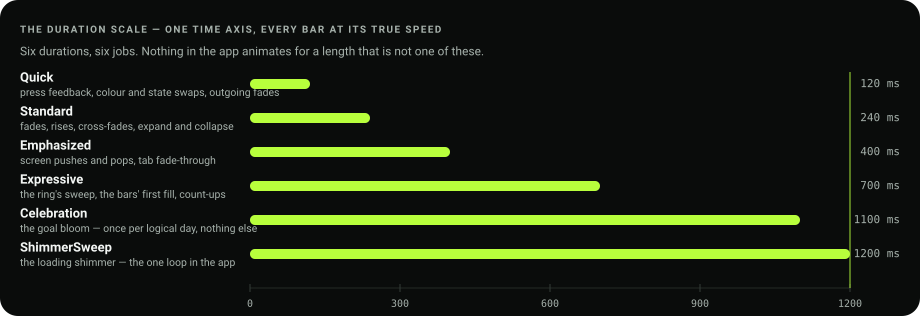

### Three curves, and a linear one


### Three springs, integrated


`Settle` and `Weighty` are both critically damped — the same curve at different speeds, which
is why they are drawn on each spring's own settle time and *felt* on the puck below, which
moves at the real one. `Lively` is the only one that overshoots, by a measured 9.5%.

### The arrival, and the cap


### The bottom bar


Material 3's `NavigationBar`, kept whole — the ripple, the `Tab` role, 80 dp, equal-weight
cells. What is ours is the indicator: M3 cross-fades a pill per item, this app slides *one*
between them, drawn behind the bar so it adds no node to the semantics tree.

### Reduced motion removes movement, not the moment

| Scheme | What it is | Where |
|---|---|---|
| `Full` | everything above | a device with animations on |
| `Reduced` | every state change and every beat, no travel — the ignition becomes a quick fade of the assembled mark, **held 900 ms** so the moment still lands | the OS setting is on |
| `Instant` | over on frame 0 | tests and previews, so a golden tree is deterministic |

The figures on this page honour it too: under `prefers-reduced-motion: reduce` each renders as
its **finished** frame rather than its first one.

**Want it interactive?** [`docs/motion-lab.html`](docs/motion-lab.html) is a single
self-contained page with all six figures and the full token catalogue — open it in a browser.
The behaviour these figures illustrate is specified in
[`specs/motion.spec.md`](specs/motion.spec.md) and decided in
[`docs/features/motion.md`](docs/features/motion.md); the wider design language is
[`docs/DESIGN-SYSTEM.md`](docs/DESIGN-SYSTEM.md).


## Quick start

```bash
# Android (device/emulator attached)
./gradlew :composeApp:installDebug

# Desktop dev-client with Compose Hot Reload — the daily dev loop
./gradlew :composeApp:hotRunDesktop --auto

# Preview EVERY screen headlessly — no device, no emulator (agents: CLAUDE.md "UI feedback loop")
./gradlew :composeApp:renderScreens && node qa/preview-gallery.mjs

# Unit tests (fast inner loop)
./gradlew :composeApp:desktopTest

# The verify lane — build + tests + every shipped gate, with an evidence receipt
node qa/verify.mjs
```

**Watch and drive the app live from a browser:** with a debug build running on a
device/emulator, run `adb forward tcp:9500 tcp:9500` and open
`http://127.0.0.1:9500/inspect/remote` — a self-contained page that mirrors the running app
(~700ms refresh) with **click-to-tap driving the real device**. The human's window into the
same app the agent inspects structurally; also the way to watch an e2e run. Debug builds
only — release builds contain no inspector code.

**iOS:** `cd iosApp && xcodegen generate && pod install`, then open
`iosApp.xcworkspace` in Xcode and run. (First time: `brew install xcodegen`.)

**Firebase:** the scaffold ships a placeholder `google-services.json`. Wire your real project
before shipping — from Claude Code, the `cmp-firebase-connect` skill drives it end to end.

## Project structure

```
specs/                       behavior specifications — new behavior starts here
composeApp/src/commonMain/   shared UI + logic (presentation / domain / data / di)
composeApp/src/commonTest/   unit tests — exemplar pattern in presentation/home
composeApp/src/desktopTest/  conformance gates + Compose UI tests + golden trees (JVM tier)
composeApp/src/androidMain/  Android entry point + platform actuals
composeApp/src/iosMain/      iOS actuals · iosApp/ is the Xcode shell
composeApp/src/desktopMain/  desktop dev-client (see docs/dev-client.md)
qa/verify.mjs                the verify lane — this repo's definition of done
qa/evidence/latest.json      the committed evidence receipt (see CONTRIBUTING.md)
qa/e2e/                      Maestro E2E flows (device smoke)
docs/                        architecture, testing, ADRs
```

## Documentation

| Doc | What |
|---|---|
| [`docs/ARCHITECTURE.md`](./docs/ARCHITECTURE.md) | Layers, data flow, how to add a feature |
| [`docs/TESTING.md`](./docs/TESTING.md) | The test pyramid, conventions, how to run everything |
| [`docs/adr/`](./docs/adr/) | Architecture decision records |
| [`CONTRIBUTING.md`](./CONTRIBUTING.md) | Workflow, definition of done, commit style |
| [`CLAUDE.md`](./CLAUDE.md) | The AI delivery contract |
| [`CHANGELOG.md`](./CHANGELOG.md) | Notable changes (Keep a Changelog) |

## Verification

Every change must pass the verify lane (`node qa/verify.mjs`) and commit its updated receipt
(`qa/evidence/latest.json`). CI re-runs the same lane on every push — see
[`.github/workflows/verify.yml`](./.github/workflows/verify.yml).

## Verification enforcement

For AI sessions using Claude Code, a **Stop hook** (`.claude/settings.json`) makes
`CLAUDE.md`'s definition of done mechanical instead of honor-system.

**What it does:** when a session tries to end, the hook runs
`node qa/receipt-check.mjs --hook`. That script recomputes a sha256 hash over the project's
verified surface (`composeApp/`, `specs/`, `qa/`, and the Gradle build files — see
`qa/lib/inputs-hash.mjs`) and compares it to the `inputs.hash` in the committed
`qa/evidence/latest.json`. A `PASS` receipt whose hash matches the tree ends the session
silently. Source changed without a fresh `PASS` — or a missing, failed, or pre-mechanism
receipt — blocks with the specific reason and asks for `node qa/verify.mjs` plus a committed
receipt. It runs no build and no tests, only file hashing, so it costs milliseconds, and it
never fires twice in a row for the same stop.

Doc-only edits (`*.md`, `README`, `.github/`, `.claude/`) are deliberately outside the
verified surface: editing docs never invalidates a good receipt. The intent is transparent
enforcement, not a hostile one.

**Escape hatch:** this is your project. If you don't want the hook, delete the `Stop` block
in [`.claude/settings.json`](./.claude/settings.json) — nothing else depends on it locally.
CI independently enforces the same "receipt attests HEAD" check on every push
(`.github/workflows/verify.yml`), so disabling the local hook only trades an immediate
signal for a later one.

---

[](https://github.com/kvdm-co-pilot/create-cmp) — the AI delivery harness for Compose Multiplatform. *(Just a static badge — delete this line if you prefer.)*
